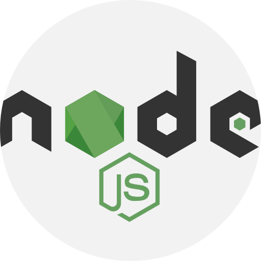

## Hi there 👋, my name is Kunal

I’m Software Developer, Passionate coder. 👀 I’m interested in coding in Java. I love java. 🌱 I’m currently learning Spring Cloud and Microservices.
💞️ I’m looking to collaborate on anything related to Java, Spring.

## Skills
>&nbsp;&nbsp;&nbsp;

## 📫 Connect with me.

 

